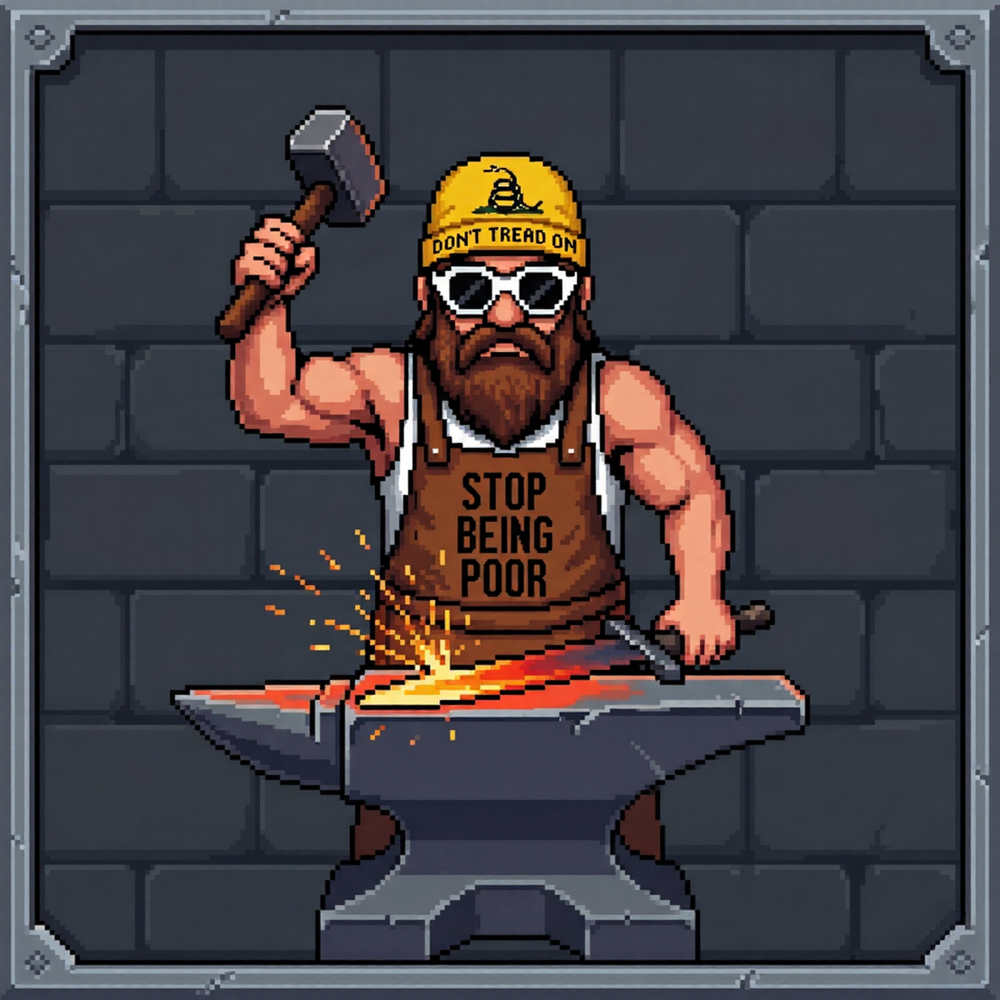
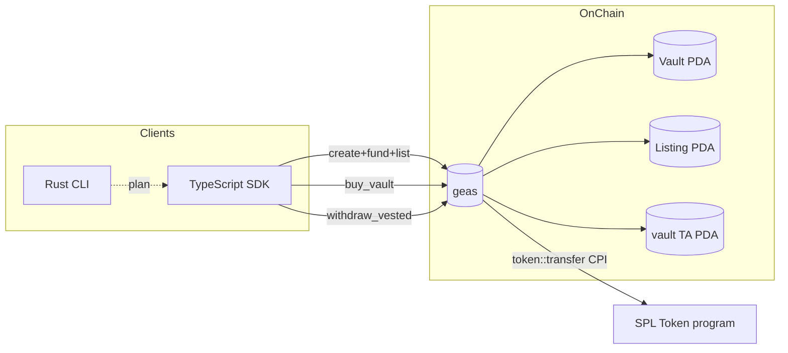

<p align="center">
  
</p>

<p align="center">
  <a href="https://github.com/Geasfun/geas/actions/workflows/ci.yml">
    
  </a>
  <a href="LICENSE">
    
  </a>
  <a href="https://github.com/Geasfun/geas/releases">
    
  </a>
  <a href="https://github.com/Geasfun/geas/commits/main">
    
  </a>
  <a href="https://github.com/Geasfun/geas/stargazers">
    
  </a>
  <a href="https://geas.fun">
    
  </a>
  <a href="https://x.com/geasfun">
    
  </a>
</p>

---

**geas** is an on-chain Anchor program plus TypeScript SDK and Rust CLI for
buying and selling vested-token positions on Solana. A seller forges a
capsule that wraps their lock; a buyer pays USDC for it; the unlock schedule
rolls forward and thawed tokens flow to whoever currently owns the vault.

## Features

| Feature                         | Scope       | Status |
| ------------------------------- | ----------- | ------ |
| Vault + Listing PDAs            | Program     | stable |
| Forge flow (3 ix bundled)       | Program+SDK | stable |
| Buy with currency CPI           | Program+SDK | stable |
| Linear unlock thaw              | Program+SDK | stable |
| Ownership transfer / gift       | Program+SDK | stable |
| Listing cancel + rent refund    | Program+SDK | stable |
| IDL artifact committed          | Repo        | stable |
| TypeScript SDK                  | SDK         | stable |
| Rust CLI (plan-mode)            | CLI         | beta   |
| Devnet integration test suite   | Tests       | beta   |

## Architecture



## Build

```bash
git clone https://github.com/Geasfun/geas
cd geas

# On-chain program
anchor build

# SDK
cd sdk && npm install && npm run build && cd ..

# CLI
cargo build --release -p geas-cli
```

## Quick start

```ts
import { Client } from "@geas/sdk";

const client = Client.connect("devnet");

const { signature, vault, listing } = await client.forge({
  wallet,
  vestingMint: "4k3Dy...",
  totalAmount: 1_000_000n,
  unlockStart: 1717200000n,
  unlockEnd:   1780272000n,
  askingPrice: 6_000_000n,
});
// => { signature: "5H3Z...", vault: "E1aF...", listing: "QbK2...", explorer: "..." }
```

Rust equivalent plan-mode:

```bash
geas-cli forge \
  --vesting-mint 4k3Dy... \
  --amount 1000000 \
  --unlock-start 2026-06-12T00:00:00Z \
  --unlock-end   2028-07-30T00:00:00Z \
  --price        6000000 \
  --currency-mint 4zMMC9srt5Ri5X14GAgXhaHii3GnPAEERYPJgZJDncDU
```

## Project structure

```
geas/
├── programs/
│   └── geas/
│       └── src/
│           ├── lib.rs              # program entry, 7 instructions
│           ├── state.rs            # Vault, Listing
│           ├── error.rs            # GeasError
│           ├── constants.rs        # PDA seeds
│           └── instructions/
│               ├── create_vault.rs
│               ├── fund_vault.rs
│               ├── list_vault.rs
│               ├── cancel_listing.rs
│               ├── buy_vault.rs
│               ├── transfer_ownership.rs
│               └── withdraw_vested.rs
├── sdk/                            # TypeScript SDK
│   ├── src/
│   │   ├── client.ts               # Client class — forge, acquire, claim, ...
│   │   ├── instructions.ts         # per-ix builders
│   │   ├── accounts.ts             # decodeVault, decodeListing, thaw math
│   │   ├── pda.ts                  # findVaultPda, findListingPda, findAta
│   │   ├── types.ts                # Vault, Listing, ForgeParams, ...
│   │   ├── constants.ts            # PROGRAM_ID, discriminators, defaults
│   │   ├── errors.ts               # typed SdkError hierarchy
│   │   └── utils.ts                # u64LE/i64LE, discriminator(), ...
│   └── tests/                      # jest unit tests
├── cli/                            # Rust CLI
│   └── src/
│       ├── main.rs
│       ├── config.rs
│       ├── rpc.rs
│       ├── util.rs
│       └── commands/
│           ├── forge.rs
│           ├── acquire.rs
│           ├── claim.rs
│           ├── cancel.rs
│           ├── inspect.rs
│           ├── listings.rs
│           └── thaw_preview.rs
├── idl/
│   └── geas.json                   # Anchor IDL (committed)
├── tests/                          # devnet integration (opt-in)
├── examples/                       # runnable SDK scripts
├── docs/                           # architecture, pda, sdk, cli
└── .github/                        # CI, templates, dependabot
```

## Deployments

Deployed on Solana devnet: [`CuoDH7XTZSqon2WhR2uixNsYrFkFRzRKgxDfra5vih53`](https://solscan.io/account/CuoDH7XTZSqon2WhR2uixNsYrFkFRzRKgxDfra5vih53?cluster=devnet)

Mainnet: pending audit.

## Contributing

PRs welcome. Read [CONTRIBUTING.md](./CONTRIBUTING.md) and the
[Code of Conduct](./CODE_OF_CONDUCT.md) first. For security-relevant issues,
see [SECURITY.md](./SECURITY.md) and email `security@geas.fun` — do **not**
open a public issue.

## License

MIT — see [LICENSE](./LICENSE).

## Links

- Website: [geas.fun](https://geas.fun)
- X: [@geasfun](https://x.com/geasfun)
- GitHub: [Geasfun/geas](https://github.com/Geasfun/geas)
- Docs: [./docs](./docs) (in-repo)
- Ticker: `$GEAS`
- Contract: [`EdVYpkVmqhza8YUKnXkz5aYRmyukao6rjo7NhzMXpump`](https://pump.fun/coin/EdVYpkVmqhza8YUKnXkz5aYRmyukao6rjo7NhzMXpump)
- Chart: [dexscreener](https://dexscreener.com/solana/EdVYpkVmqhza8YUKnXkz5aYRmyukao6rjo7NhzMXpump)
- Devnet program: [`CuoDH7XTZSqon2WhR2uixNsYrFkFRzRKgxDfra5vih53`](https://solscan.io/account/CuoDH7XTZSqon2WhR2uixNsYrFkFRzRKgxDfra5vih53?cluster=devnet)
