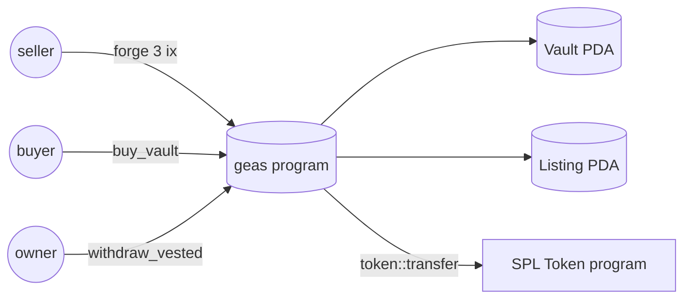

# Architecture

geas is a single Anchor program plus a thin client surface (TypeScript SDK,
Rust CLI) that wraps it.



## On-chain layout

Everything the program needs lives in two PDAs.

- **Vault**: owned by whoever currently holds the capsule. Stores the vesting
  mint, the full unlock schedule, how much has been claimed, and a monotonic
  `vault_id` so the same creator can issue multiple vaults.
- **Listing**: derived from the vault. One active listing per vault at a time;
  closing the listing refunds rent to whoever opened it.

A third PDA — the vault's SPL token account — is controlled by the program
itself. Withdrawals are always a `token::transfer` CPI from that PDA into the
current owner's associated token account.

## Forge flow

Because three instructions are involved (`create_vault` + `fund_vault` +
`list_vault`), the SDK's `Client.forge` helper bundles them into a single
transaction so the seller signs once:

```
tx ─ create_vault ─ fund_vault ─ list_vault
```

Transaction size is well under 1232 bytes, so bundling is safe.

## Acquire flow

The buyer signs one `buy_vault` instruction. It:

1. Transfers `listing.price` from the buyer's currency ATA to the seller's.
2. Swaps `vault.owner` from `seller` to `buyer`.
3. Marks the listing inactive and closes it to refund rent.

The client prepends ATA-creation instructions if the buyer or seller has never
touched the currency mint before.

## Thaw

Thaw is a linear function of time. A view helper reproduces the on-chain math
exactly so UIs can show a progress bar without a round-trip:

    thawed = total * max(0, min(1, (now − start) / (end − start)))
    withdrawable = thawed − claimed_amount

Integer math, truncated toward zero, matches what `withdraw_vested` does.
